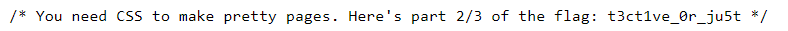
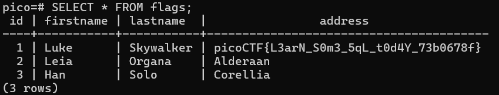
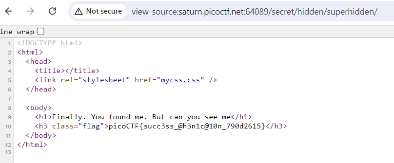
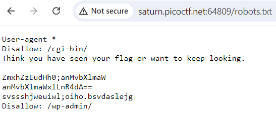
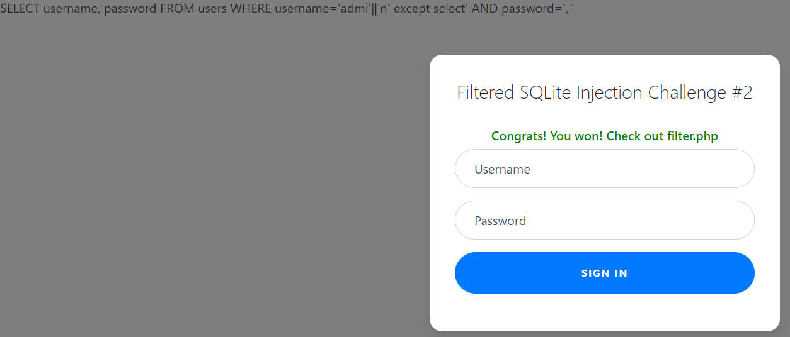
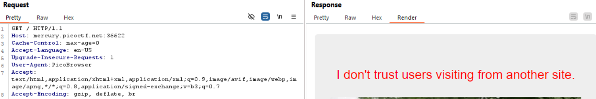
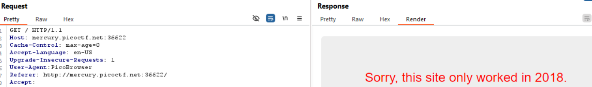
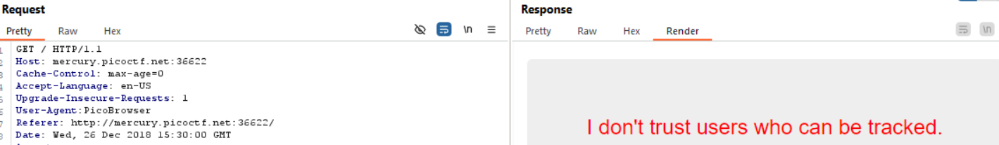
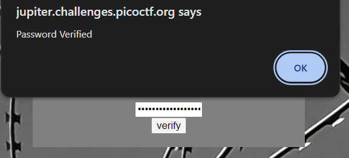

# Unminify
-- Ctrl + U -> Xem mã nguồn -> Vì flag có dạng picoCTF{FLAG} -> Sử dụng biểu thức chính quy để tìm kiếm. 
```
var bodyText = document.body.innerText;
var flag = bodyText.match(/picoCTF{.*?}/);
console.log(flag);
```


# WebDecode
-- Xem mã nguồn -> Thử truy cập các liên kết -> Trang **About** có nội dung :"Try inspecting the page!! You might find it there" ( Thử kiểm tra trang! Bạn có thể tìm thấy nó ở đó ) -> Phát hiện ra chuỗi `cGljb0NURnt3ZWJfc3VjYzNzc2Z1bGx5X2QzYzBkZWRfMTBmOTM3NmZ9` trong html -> Thử decode base64 bằng hàm atob trong js thu được : picoCTF{web_succ3ssfully_d3c0ded_10f9376f}


# Bookmarklet
-- Xem mã nguồn -> Tìm được đoạn mã js khá đặc biệt 


-- Thử copy đoạn mã vào console để thực thi -> Flag 


# Local Authority
-- Xem mã nguồn trang login.php thì thấy được liên kết tới file **secure.js**. Thử truy cập -> Có được nội dung js như sau :


-- Tiếp tục xem trang login.php, giá trị tham số username và password chúng ta nhập sẽ được kiểm tra bởi hàm checkPassword. Nếu true thì hiển thị thông báo login thành công. Biết rằng username='`admin`' và password='`strongPassword098765`' ở hàm checkPassword


-- Đăng nhập thành công và lấy được flag


# Inspect HTML
-- Xem mã nguồn -> Flag đã bị comment 


# Includes
-- Xem mã nguồn -> liên kết đến **script.js** -> Thử truy cập -> Kí tự cuối là `}` nên đây có thể là phần cuối của flag -> Tìm các phần còn lại 


-- Thử đi tới **style.css** -> Phần đầu của flag. Kết hợp đầu và cuối -> Flag 


# GET aHEAD
-- Request gửi đi khi lựa chọn Red


-- Request gửi đi khi lựa chọn Blue


-- Nhìn kỹ 2 req này, có tới 2 phương thức khác nhau. Tại sao phương thức POST thường dùng để gửi dữ liệu nhưng ở đây lại không có dữ liệu trong phần body nhỉ ? Hint : Có thể bạn có hơn 2 lựa chọn -> Lựa chọn ở đây là các phương thức ? Các phương thức trong http request : GET, POST, PUT, DELETE, PATCH, HEAD. Thử các phương thức -> Đến lượt HEAD thì nhận được flag


# dont-use-client-side
-- Xem mã nguồn -> hàm verify kiểm tra các điều kiện -> Có vẻ như khi ghép các chuỗi được so sánh trong câu điều kiện thì lấy được flag. Nhưng nhìn kỹ thì thứ tự flag chưa được sắp xếp. Biết rằng, flag có dạng picoCTF -> Phát hiện ra quy luật : giá trị mà split nhân tăng dần theo cột bên trái hoặc phải thì khi nối các chuỗi được so sánh -> flag 


-- Flag : picoCTF{no_clients_plz_b706c5}


# Scavenger Hunt
-- Xem mã nguồn -> phần đầu của flag : `picoCTF{t`. Tiếp theo, kiểm tra các files (js,css,html)


-- Truy cập liên kết đến **mycss.css** lấy được phần thứ 2 của flag :  `h4ts_4_l0`


-- Truy cập liên kết đến **myjs.js** thì xuất hiện chuỗi có ý nghĩa gần giống như sau : "Làm thế nào tôi có thể ngăn Google liệt kê trang web của mình vào kết quả tìm kiếm ?". Tài liệu tham khảo : https://support.google.com/news/publisher-center/answer/9605477?hl=vi


-- Truy cập vào `robots.txt` để xem các trang bị ngăn chặn -> Phần thứ 3 của flag : `t_0f_pl4c`. Có đoạn nội dung như sau : "Tôi nghĩ đây là máy chủ Apache .. Bạn có thể truy cập vào flag kế tiếp hay không ? 


-- Truy cập vào `.htaccess` (tệp cấu hình của Apache) -> Phần thứ 4 của flag : `3s_2_lO0k`. Có đoạn nội dung như sau :"Tôi yêu làm việc với websites trên máy Mac, tôi có thể lưu trữ nhiều thông tin ở đó" -> Ở đó là ở đâu ? 


-- Search : Which file can I use to store information on Mac ? -> `.DS_Store` -> Phần 5 của flag : `_35844447}`


-- Flag : `picoCTF{th4ts_4_l0t_0f_pl4c3s_2_lO0k_35844447}`


# logon
-- Quan sát cookies sau khi đăng nhập, có 1 cookie tên là `'admin'` và có giá trị là `False`. Có khi nào cookie này được dùng để xác thực admin hay không ? -> Thử sửa đổi giá trị thành `True`


-- Kết quả sau khi sửa đổi giá trị của cookie -> Flag : `picoCTF{th3_c0nsp1r4cy_l1v3s_0c98aacc}`


# Insp3ct0r
-- Xem mã nguồn -> Lấy được phần 1 của flag : `picoCTF{tru3_d3`


-- Truy cập vào liên kết đến **mycss.css** -> Phần 2 của flag : `t3ct1ve_0r_ju5t`



-- Truy cập vào liên kết đến **myjs.js**  -> Phần 3 của flag : `_lucky?2e7b23e3}`


-- Flag : `picoCTF{tru3_d3t3ct1ve_0r_ju5t_lucky?2e7b23e3}`


# where are the robots
-- Xem mã nguồn -> Chỉ có nội dung ">Where are the robots?" là đặc biệt


-- Robots ở đây có thể là robots.txt -> Thử truy cập đến robots.txt -> Disallow: /1bb4c.html (ngăn chặn crawl dữ liệu đối với đường dẫn này) 


-- Thử truy cập đến **1bb4c.html** -> Flag : `picoCTF{ca1cu1at1ng_Mach1n3s_1bb4c}`


# More SQLi
-- Khi gửi đăng nhập username=user và password=pass  -> Nhận phản hồi chứa câu truy vấn : `SELECT id FROM users WHERE password = 'pass' AND username = 'user'`

-- Thay đổi password=`' OR 1=1-- ` -> Đăng nhập thành công -> Flag : `picoCTF{G3tting_5QL_1nJ3c7I0N_l1k3_y0u_sh0ulD_e3e46aae}`


-- Tìm hiểu các chức năng sau khi đăng nhập -> Ở chức năng tìm kiếm, kết quả trả về có 3 cột -> Thử search : `abc' UNION SELECT 1,2,3-- ` -> Chức năng search bị lỗi sqli 


-- Vì ở phần hint đã gợi ý **sqlite** nên ta thử kiểm tra bằng cách search : `abc' UNION SELECT 1,sqlite_version(),3-- `. Kết quả trả về là phiên bản 3.31.1 của sqlite


-- Tiếp theo, lấy tên và lệnh tạo ra đối tượng cho bảng tương ứng -> `abc' UNION SELECT name, sql, NULL FROM sqlite_master--` -> Phát hiện ra trong bảng more_table có một cột flag


-- Lấy nội dung cột flag từ bảng more_table : `abc' UNION SELECT NULL, flag, null FROM more_table--` -> Flag : `picoCTF{G3tting_5QL_1nJ3c7I0N_l1k3_y0u_sh0ulD_e3e46aae}`


# MatchTheRegex
-- `^p.....F!?` : có vẻ như đây là biểu thức chính quy -> ^p : bắt đầu bằng kí tự p, .....F : 5 kí tự bất kì(ngoại trừ xuống dòng) và 1 kí tự F tiếp theo, !? : 1 dấu ! hoặc 0 ! . Ví dụ :  pabcdeF! , p12345F, ...


-- Gửi chuỗi thỏa biểu thức chính quy -> FLag : `picoCTF{succ3ssfully_matchtheregex_08c310c6}`


# findme
-- Quan sát 2 request gửi đi sau khi gửi tới /login, giá trị của tham số 'id' có vẻ như đã được encode base64. Thử decode base64 2 giá trị này


-- Tô đen chuỗi và nhìn sang bên phải phần Inspector đang hiển thị giá trị sau khi decode base64 -> Phần đầu của flag : `picoCTF{proxies_al`


-- Tương tự -> Phần cuối của flag : `l_the_way_df44c94c}`


-- Flag : `picoCTF{proxies_all_the_way_df44c94c}`


# SQLiLite
-- Đăng nhập bằng username=user và password=pass thì Login failed.


-- Thay đổi username=`user' OR 1=1-- ` và password=pass -> Bypass thành công nhưng không thấy hiển thị flag -> Xem mã nguồn : flag đã bị thuộc tính hidden ẩn đi. Flag : `picoCTF{L00k5_l1k3_y0u_solv3d_it_d3c660ac}`


# SQL Direct
-- Sau khi kết nối, dùng lệnh `\l` để hiển thị các cơ sở dữ liệu


-- Dùng lệnh `\l pico` để đi vào cơ sở dữ liệu pico. Sau đó, `\dt` để hiển thị các bảng trong csdl pico. Tìm thấy bảng tên là flag 


-- Thử đọc toàn bộ dữ liệu của bảng flag -> Flag : `picoCTF{L3arN_S0m3_5qL_t0d4Y_73b0678f}`




# Secrets
-- Xem mã nguồn -> Ngoài liên kết đến "secret/assets/index.css" thì không có gì khả nghi. Truy cập đến thì phản hồi chỉ là tệp css bình thường. 


-- Đi vào thư mục assets -> Bị cấm 


-- Đi vào thư mục secret -> Có 1 liên kết đến "hidden/file.css" 


-- Truy cập "hidden/file.css" thì hoàn toàn rỗng -> Đi vào thư mục hidden -> Tìm thấy trường dữ liệu bị ẩn 


-- Truy cập "superhidden/xdfgwd.html" -> Not Found -> Thử đi vào thư mục superhidden -> Flag : `picoCTF{succ3ss_@h3n1c@10n_790d2615}`




# Search source
-- Xem mã nguồn -> Có nhiều tài nguyên (css,js,html) cần phải kiểm tra. Mà để tìm ra flag chúng ta không cần phải search ở từng trang web -> Tải xuống toàn bộ các tài nguyên rồi chỉnh sửa lại đầu ra là xong.

-- Đầu tiên, tạo một thư mục tạm thời để lưu tài nguyên của trang web -> Sử dụng lệnh `wget -m target` để tải tất cả tài nguyên liên quan của trang web


-- `grep -rE "picoCTF{.*?}" thư_mục_chứa_tài_nguyên` để tìm kiếm flag -> Flag : `picoCTF{1nsp3ti0n_0f_w3bpag3s_ec95fa49}`


# Roboto Sans
-- Có vẻ như không có điều gì khả nghi từ các file (css,js,html). Truy cập vào trang robots.txt. Có 2 thư mục bị Disallow -> Truy cập vào 2 thư mục thì kết quả trả về đều là Not Found. 



-- Có 1 đoạn nội dung giống như đã encode base64 -> Thử Decode base64 thì có vẻ như không phải đều là base64 -> Decode từng dòng -> Dòng 2 trả về kết quả decode : `js/myfile.txt` -> Truy cập tới thì tìm thấy flag. 


-- Flag : `picoCTF{Who_D03sN7_L1k5_90B0T5_718c9043}`


# Power Cookie
-- Mở dev tools và tới phần Application -> Tìm thấy cookie 'isAdmin' đang có giá trị 0. Giá trị 0 ở đây có lẽ đại diện cho giá trị false (không phải admin). Sẽ ra sao nếu ta chỉnh sửa value thành 1 và gửi lại cookie ?


-- Sau khi sửa giá trị lại thành 1 -> Flag : `picoCTF{gr4d3_A_c00k13_65fd1e1a}`


# Forbidden Paths
-- Trang web có chức năng : cho phép đọc nội dung của file khi nhập filename. Biết rằng, các files của website nằm ở /usr/share/nginx/html/ và flag nằm ở /flag. Sẽ ra sao nếu ta nếu filename là đường dẫn đi tới nơi chứa flag ? Ở phần mô tả, đường dẫn tuyệt đối đã bị filter -> Sử dụng đường dẫn tương đối 


-- Vì đang nằm trong /usr/share/nginx/html/ nên phải đi lên 4 cấp để tới thư mục / -> filename là  `../../../../flag` -> Nhận được flag. Tip : nếu không biết trước được số cấp thư mục thì thử tăng dần `../` cho tới khi đến / (thư mục root)


-- Flag : `picoCTF{7h3_p47h_70_5ucc355_e5a6fcbc}`


# caas
-- Kiểm tra file index.js -> Tham số động nằm sau /cowsay/ sẽ được truyền vào hàm exec để thực thi


-- Truyền `hello;ls` để thực thi câu lệnh ls và hiển thị kết quả ra màn hình


-- Tìm thấy một file có tên sau khi sắp xếp lại có vẻ là flag.txt. Truyền `hello;cat falg.txt` -> Flag : `picoCTF{moooooooooooooooooooooooooooooooooooooooooooooooooooooooooooo0o}`


# login
-- Xem mã nguồn -> Truy cập index.js có được nội dung đã được sắp xếp lại và comment như sau :
``` 
(async () => {
    await new Promise((resolve) => window.addEventListener("load", resolve));

    document.querySelector("form").addEventListener("submit", (event) => {
        event.preventDefault();

        const selectors = {
            u: "input[name=username]",
            p: "input[name=password]",
        };

        const encodedValues = {};

        //Encode base64 giá trị username, password rồi loại bỏ '='  
        for (const key in selectors) {
            encodedValues[key] = btoa(document.querySelector(selectors[key]).value).replace(/=/g, "");
        }

        So sánh giá trị username sau khi encode với "YWRtaW4"
        if (encodedValues.u !== "YWRtaW4") {
            alert("Incorrect Username");

        So sánh giá trị password sau khi encode với "cGljb0NURns1M3J2M3JfNTNydjNyXzUzcnYzcl81M3J2M3JfNTNydjNyfQ"
        } else if (encodedValues.p !== "cGljb0NURns1M3J2M3JfNTNydjNyXzUzcnYzcl81M3J2M3JfNTNydjNyfQ") {
            alert("Incorrect Password");
        } else {
            alert(`Correct Password! Your flag is ${atob(encodedValues.p)}.`);
        }
    });
})();

```
-- Để lấy được flag thì username và password sau khi encode base64 và loại bỏ '=' -> Decode 2 chuỗi được dùng để so sánh -> "admin" và "picoCTF{53rv3r_53rv3r_53rv3r_53rv3r_53rv3r}" -> Đăng nhập -> Nhận được flag : `picoCTF{53rv3r_53rv3r_53rv3r_53rv3r_53rv3r}`


# JAuth
-- Quan sát phản hồi, khi gửi username và password lên server thì nhận được token -> Nhìn kỹ thì giá trị của token được chia thành 3 phần cách nhau bởi dấu chấm -> JSON Web Token -> Decode phần đầu : loại JWT, thuật toán HS256


-- Bằng cách kết hợp phần header và payload đã được mã hóa. Sau đó, sử dụng thuật toán trong header để tạo chữ ký với khóa bí mật. Nếu thuật toán (alg) trong header là **none** thì đồng nghĩa với việc không có phần chữ ký ở JWT. Sẽ ra sao khi server không kiểm tra thuật toán được phép trong quá trình xác thực JWT do users gửi lên ? 

-- Truy cập [link](https://token.dev/) . Paste giá trị của token nhận được vào phần JWT String. Chỉnh sửa giá trị 'alg' ở phần Header thành 'none'(không sử dụng thuật toán) và giá trị của 'role' (vai trò) thành 'admin' để nâng quyền từ user thành admin. Cuối cùng copy JWT String và thêm vào cuối chuỗi JWT kí tự `.` 


-- Gửi token mới -> Flag : `picoCTF{succ3ss_@u7h3nt1c@710n_3444eacf}`


# Super Serial
-- Xem mã nguồn thì không phát hiện điều gì khả nghi -> Truy cập robots.txt -> Tìm thấy `Disallow: /admin.phps`. Tại sao lại là đuôi .phps mà không phải là đuôi .php thường thấy ? Search : what is the file extension .phps used for ? -> Phần mở rộng `.phps` hiển thị mã nguồn có định dạng màu sắc trực tiếp trên trình duyệt còn `.php` hiển thị kết quả sau khi thực thi trực tiếp trên trình duyệt. Thử áp dụng : 


-- Truy cập /admin.php và /admin.phps thì kết quả đều là Not Found. Liêụ rằng khi truy cập vào /index.phps thì kết quả trả về có chứa mã nguồn của index.php hay không ? -> Trường hợp này là có -> Quan sát, tìm thấy 2 file php : cookie.php và authentication.php. Giá trị của cookie 'login' phụ thuộc vào username và password. Sau đó, chuyển hướng tới authentication.php


-- Truy cập /authentication.phps. Quan sát phần if : $perm được lấy ra từ cookie.php, nếu tồn tại $perm và kết quả khi gọi phương thức is_admin trả về true thì xác thực admin thành công. Tiếp theo, phân tích lớp access_log : phương thức read_log trả về kết quả khi gọi hàm file_get_contents với đối số truyền vào là giá trị nhận vào khi khởi tạo lớp.


-- Truy cập /cookie.phps. Quan sát phần try : giá trị cookie 'login' gọi 2 phương thức is_guest và is_admin để kiểm tra quyền. Vì Prepared Statements trong is_admin() đã sử dụng đúng cách nên không gây ra lỗi. Phần catch : Nếu lỗi thì hiển thị "Deserialization error." + $perm mà $perm có thể bị thao túng qua cookie 'login' và bị xem như là một chuỗi. Để gây ra lỗi thì $perm là một lớp khác không có phương thức is_guest hoặc is_admin -> Ý tưởng : sử dụng lớp access_log ở authentication với giá trị nhận vào là '../flag' thì khi gọi các phương thức của $perm sẽ bị lỗi và chuyển qua phần catch. Vì $perm được xem như một chuỗi nên tự động kích hoạt hàm __toString của lớp access_log. Mà trong __toString gọi tới hàm read_log. Trong hàm read_log sử dụng hàm file_get_contents để trả về nội dung của một tệp.


-- Thực hiện ý tưởng : 
+ Tạo cookie 'login' 
```
<?php
class access_log
{
	public $log_file;

	function __construct($lf) {
		$this->log_file = $lf;
	}
}
$ac=new access_log("../flag");
echo(urlencode(base64_encode(serialize($ac))));
?>
```


+ Gửi cookie tới /authentication.php -> Flag : `picoCTF{th15_vu1n_1s_5up3r_53r1ous_y4ll_9d0864e2}`


# Web Gauntlet 2
-- Các kí tự hoặc chuỗi bị filter : [`or and true false union like = > < ; -- /* */ admin` ]. Username không được nhập trực tiếp đầy đủ 'admin' -> Sử dụng || trong sqlite để nối chuỗi thì có dạng như sau username='string_1'||'string_2'||'string_3'. Nhờ vào hint nên biết được csdl được sử dụng là sqlite. Mà sqlite có 2 loại comment là -- và /* */ nên không thể biến vế sau thành comment được. Ở phần password có thể đổi thành biểu thức logic : password='a' IS NOT 'b'.

-- Áp dụng : username=`admi'||'n` &  password=`a' IS NOT 'b`


-- Một cách khác :  có thể loại bỏ vế sau là sử dụng except kết hợp select -> username=`admi'||'n' except select` & password=`,'` -> Câu truy vấn trở thành :
```
SELECT username, password 
FROM users 
WHERE username='admi'||'n' 
EXCEPT 
SELECT ' AND password=',''
```


-- Truy cập /filter.php -> Flag : `picoCTF{0n3_m0r3_t1m3_9605a246c21764e7691ca04679ad321a}`


# Who are you ?
-- Thông báo :"Chỉ những người sử dụng **PicoBrowser** thực sự mới được phép truy cập vào trang này". "PicoBrowser" ở đây là tên trình duyệt ? Vậy trường nào chứa thông tin về trình duyệt khi gửi http req ? -> User-Agent 


-- Thay đổi `User-Agent:  PicoBrowser` thì nhận được thông báo :"Tôi không tin tưởng những người dùng đến từ trang khác". Vậy trường nào dùng để chỉ định req đến từ trang hiện tại ? -> Referer



-- Thay đổi `Referer: http://mercury.picoctf.net:36622/` thì nhận được thông báo :"Trang này đã làm việc ở năm 2018". Vậy trường nào dùng để xác định thời gian tạo ra req ? -> Date 



-- Thay đổi `Date: Wed, 26 Dec 2018 15:30:00 GMT` thì nhận được thông báo :"Tôi không tin những người bị theo dõi". Vậy trường nào dùng để xác định rằng không được phép theo dõi các hoạt động ? -> DNT 



-- Thay đổi `DNT:1` (1:bật) thì nhận được thông báo :"Trang này chỉ dành cho những người ở Thụy Điển". Vậy trường nào dùng để xác định vị trí của req ? -> X-Forwarded-For   


-- Thay đổi `X-Forwarded-For: 102.177.146.0` (yêu cầu : ip ở Thụy Điển) thì nhận được thông báo:"Bạn ở Thụy Điển nhưng tại sao bạn không nói tiếng Thụy Điển ?". Vậy trường nào dùng để xác định ngôn ngữ để giao tiếp ? -> Accept-Language


-- Thay đổi `Accept-Language: sv-SE` thì nhận được flag : `picoCTF{http_h34d3rs_v3ry_c0Ol_much_w0w_0da16bb2}`


# Some Assembly Required 1
-- Xem mã nguồn -> Truy cập vào liên kết đến file js : quan sát ở hàng thứ 2 có chuỗi `./JIFxzHyW8W` có vẻ là 1 đường dẫn tương đối 


-- Truy cập `/JIFxzHyW8W` thì nhận được file binary -> Phân tích và hiển thị các chuỗi trong file bằng lệnh `strings filename` -> Flag : `picoCTF{a8bae10f4d9544110222c2d639dc6de6}`


# Web Gauntlet 3
-- Tương tự như Web Gauntlet 2 nhưng ở đây đã giới hạn độ dài input nên chỉ có 1 cách đúng -> username=`admi'||'n` & password=`a' IS NOT 'b` -> Flag : `picoCTF{k3ep_1t_sh0rt_68847fdd50e1430d80990b518fac4edb}`


# Web Gauntlet
-- Sử dụng comment để bypass -> username=`admin'--`


-- Sử dụng comment để bypass ->  username=`admin'/*` & password=abc. Hoặc là sử dụng union để nối dài câu truy vấn -> password= `abc' UNION SELECT 'admin','1` & username=abc


-- Sử dụng `;` để kết thúc câu truy vấn -> username=`admin';` & password=abc


-- Sử dụng || để nối chuỗi -> username=`admi'||'n';` & password=abc. Round 5 sử dụng tương tự Round4


--  -> Flag : `picoCTF{y0u_m4d3_1t_96486d415c04a1abbbcf3a2ebe1f4d02}`


# Irish-Name-Repo 1
-- Test : username=`admin'-- ` & password=abc -> Flag : `picoCTF{s0m3_SQL_c218b685}`


# Irish-Name-Repo 2
-- Test : username=`admin'-- ` & password=abc -> Flag : `picoCTF{m0R3_SQL_plz_fa983901}`


# Irish-Name-Repo 3
-- Quan sát request, tìm thấy tham số 'debug' đang có giá trị bằng 0.


-- Thay đổi giá trị debug=1 thì hiển thị input và câu truy vấn 


-- Test : password=`' OR 1=1-- `. Quan sát câu truy vấn thì có vẻ như 'OR' đã chuyển đổi thành "BE". Phân tích : 'O' với 'B' cách nhau 13 vị trí và 'R' với 'E' cũng tương tự -> Có thể là password nhập vào sẽ được mã hóa ROT13 


-- Decode ROT13 của `' OR 1=1-- ` trả về kết quả là `' BE 1=1-- ` -> Khi gửi password=`' BE 1=1-- ` thì password sẽ được encode ROT13 thành `' OR 1=1-- ` và login thành công -> Flag : `picoCTF{3v3n_m0r3_SQL_06a9db19}`


# picobrowser
-- Khi click vào 'Flag' thì nhận được thông báo :"Bạn không phải là `picobrowser` và đoạn thông tin có vẻ như là giá trị của trường User-Agent trong Request"


-- Thay đổi giá trị của trường User-Agent thành `picobrowser` -> Flag : `picoCTF{p1c0_s3cr3t_ag3nt_84f9c865}`


# Client-side-again
-- Xem mã nguồn -> Có vẻ như đoạn mã js đã bị che dấu (Obfuscated)


-- Search : format js code -> Tìm thấy trang này để chỉnh sửa mã js đẹp hơn-> [Click here](https://deobfuscate.io/)  thu được kết quả như sau : 

```
var _0x5a46 = ["f49bf}", "_again_e", "this", "Password Verified", "Incorrect password", "getElementById", "value", "substring", "picoCTF{", "not_this"];
(function (_0x4bd822, _0x2bd6f7) {
  var _0xb4bdb3 = function (_0x1d68f6) {
    while (--_0x1d68f6) {
      _0x4bd822.push(_0x4bd822.shift());
    }
  };
  _0xb4bdb3(++_0x2bd6f7);
}(_0x5a46, 435));
var _0x4b5b = function (_0x2d8f05, _0x4b81bb) {
  _0x2d8f05 = _0x2d8f05 - 0;
  var _0x4d74cb = _0x5a46[_0x2d8f05];
  return _0x4d74cb;
};
function verify() {
  checkpass = document[_0x4b5b("0x0")]("pass")[_0x4b5b("0x1")];
  split = 4;
  if (checkpass[_0x4b5b("0x2")](0, split * 2) == _0x4b5b("0x3")) {
    if (checkpass[_0x4b5b("0x2")](7, 9) == "{n") {
      if (checkpass[_0x4b5b("0x2")](split * 2, split * 2 * 2) == _0x4b5b("0x4")) {
        if (checkpass[_0x4b5b("0x2")](3, 6) == "oCT") {
          if (checkpass[_0x4b5b("0x2")](split * 3 * 2, split * 4 * 2) == _0x4b5b("0x5")) {
            if (checkpass["substring"](6, 11) == "F{not") {
              if (checkpass[_0x4b5b("0x2")](split * 2 * 2, split * 3 * 2) == _0x4b5b("0x6")) {
                if (checkpass[_0x4b5b("0x2")](12, 16) == _0x4b5b("0x7")) {
                  alert(_0x4b5b("0x8"));
                }
              }
            }
          }
        }
      }
    }
  } else {
    alert(_0x4b5b("0x9"));
  }
}

```
-- Sử dụng Console trên Dev tools để lấy các giá trị trước khi mã hóa. Sau đó, thay các giá trị vào vị trí tương ứng. Hàm verify dùng để xác thực nên ưu tiên giải mã trước 


-- Kết quả sau khi thay : 

```
function verify() {
  checkpass = document[getElementById]("pass")[value];
  split = 4;
  if (checkpass["substring"](0, split * 2) == "picoCTF{") {
    if (checkpass["substring"](7, 9) == "{n") {
      if (checkpass["substring"](split * 2, split * 2 * 2) == "not_this") {
        if (checkpass["substring"](3, 6) == "oCT") {
          if (checkpass["substring"](split * 3 * 2, split * 4 * 2) == "f49bf}") {
            if (checkpass["substring"](6, 11) == "F{not") {
              if (checkpass["substring"](split * 2 * 2, split * 3 * 2) == "_again_e") {
                if (checkpass["substring"](12, 16) == "this") {
                  alert("Password Verified");
                }
              }
            }
          }
        }
      }
    }
  } else {
    alert("Incorrect password");
  }
}
```
-- Debug từng câu lệnh if thu được :
+ 0 ->  8 : `picoCTF{`
+ 7 ->  9 : `{n`
+ 8 ->  16 : `not_this`
+ 3 ->  6 : `oCT`
+ 24 -> 32 : `f49bf}`
+ 16 -> 24 : `_again_e`
+ 12 -> 16 : `this`

-> Ghép đúng vị trí thì thu được : `picoCTF{not_this_again_ef49bf}` -> Xác thực thành công và đây cũng là flag 




