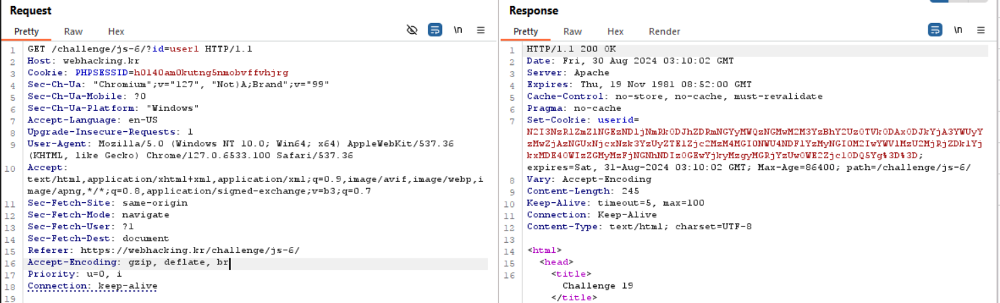
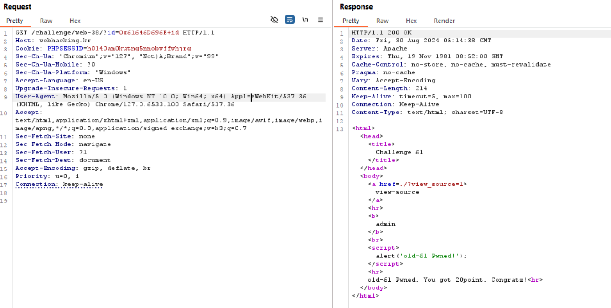

# old-15
-- Khi gọi API -> nhận được hộp thông báo 'Access_Denied' rồi chuyển hướng tới trang chủ (/). Sau đó, hiển thị liên kết từ trang hiên tại + **?getFlag** (nhưng vì đã chuyển hướng nên không thể thấy được liên kết này)


-- Truy cập vào địa chỉ mà nó trỏ tới 


# old-26
-- View source -> đoạn mã php có nội dung như sau : lấy ra tham số  'id' khi gửi bằng GET method so sánh với chuỗi 'admin'. Nếu trùng thì exit, ngược lại thì sử dụng hàm urldecode và gán lại giá trị tham số 'id'. Nếu bằng 'admin' thì giải thành công. 


-- Chuỗi 'admin' sau khi được gửi qua url thì trình duyệt sẽ tự động encode URL trước khi gửi request tới server và khi server nhận sẽ tự động decode URL để lấy thông tin. Tiếp theo, urldecode() trong php sẽ tìm các chuỗi ký tự dạng %xy (hex) trong chuỗi đầu vào và thay thế chúng bằng ký tự tương ứng trong bảng mã ASCII. Như vậy, URL sẽ được decode 2 lần -> Nếu như encode chuỗi 'admin' 2 lần sang dạng hex rồi gửi lên server và khi tới hàm preg_match thì lúc này giá trị $_GET['id'] mới chỉ decode 1 lần nên sẽ bypass thành công. Sau đó, hàm urldecode sẽ decode lần 2 và  $_GET['id']='admin' 

-- Thực hiện trên Burp Suite :
+ Chuyển 'admin' sang hex -> `%61%64%6D%69%6E`
+ EncodeURL : Ctrl + U -> `%2561%2564%256D%2569%256E`


# old-16
-- Quan sát hàm mv ở respone, có sự điều hướng tới file có đuôi php khi giá trị của cd = 124


-- Kiểm tra tên file php mà nó điều hướng tới -> `String.fromCharCode(cd)+".php"` -> Điều hướng trang hiện tại tới `|.php`


-- Thử gửi req đến đường dẫn đó 


# old-39
-- Lấy ra trường 'id' từ form gửi lên. Nếu như input sẽ thay thế khi chứa `\` thành bằng rỗng, `'` thành `''` và tối đa và 15 kí tự. Câu truy vấn : `select 1 from member where length(id)<14 and id='{$_POST['id']}` -> Cuối câu truy vấn thiếu 1 dấu `'` để đóng


-- Từ replace `'` thành `''` , câu truy vấn thiếu `'`và lấy 15 kí tự sau khi replace -> Sẽ ra sao nếu như kí tự thứ 15 là `'` ? Lúc này, kí tự `'` sẽ thành `''` nhưng vì chỉ lấy 15 kí tự nên câu truy vấn vẫn hợp lệ.

-- Thực hiện : Giả sử chọn id=1 thì payload=`1             '` (13 kí tự space) rồi encodeURL


# old-27
-- Ngăn chặn các kí tự `# , select , ( ,   , limit , = , 0x ` không phân biệt hoa thường. Câu truy vấn : `select id from chall27 where id='guest' and no=({$_GET['no']})`. Để chỉ trả về kết quả id='admin' (no=2) -> phép AND phải trả và false ->sử dụng OR để câu truy vấn đúng (phép AND sẽ thực hiện trước rồi tới phép OR) *Search : operator precedence in sql để tham khảo


-- Sử dụng `)` để thoát và nối dài bằng `OR no LIKE 2-- ` nhưng vì = và khoảng trắng đã bị chặn -> `LIKE` thay `=` và ` ` thành `tab` -> Payload =`0)%09OR%09no%09LIKE%092--%09` (%09 : tab) 


# old-18 
-- Ngăn chặn các kí tự  ` space  , / , ( , ) , | , & , select , from , 0x ` không phân biệt hoa thường. Để chỉ trả về kết quả id='admin' (no=2) -> phép AND phải trả và false -> Sử dụng OR để nối dài câu truy vấn 


-- Thử no=1 -> trong res có chuỗi 'hi guest' -> phép AND sẽ đúng -> Hiển thị kết quả của id='guest' **đầu tiên** mặc kệ điều kiện OR  đúng hay sai -> no!=1 và điều kiện sau OR có thể là id='admin' hoặc no=2.


-- Vì kí tự khoảng trắng bị chặn nên thay bằng tab hoặc kí tự xuống dòng
+ payload_1 : 0 OR no=2 -> Sau khi encode : `0%09OR%09no%3d2` 
+ payload_2 : 0 OR id='admin' -> Sau khi encode : `0%09OR%09id%3d'admin'`
+ Nếu sử dụng kí tự xuống dòng thì thay `%09` thành `%0A` 


# old-14
-- Quan sát respone trả về, khi thỏa điều kiện trong hàm ck thì điều hướng trang hiện tại tới nơi nào đó.


-- Mở console, kiểm tra giá trị của ul. Tiếp theo, điều hướng tới url hiện tại kết hợp với tham số đã được tính toán 


# old-06
-- Để thỏa điều kiện thì $_COOKIE['user'] và $_COOKIE['password'] sau khi decode phải bằng 'admin' và 'nimda'. 


-- Khi chưa có $_COOKIE['user'] thì gán các giá trị mặc định rồi encode. Cuối cùng gửi cookie về cho người dùng.


-- Như vậy, nếu như gán Cookie : user=admin ; passord=nimda rồi encode thì khi decode sẽ thỏa mãn điều kiện ban đầu.

-- Tận dụng đoạn mã php :
```
<?php
 $val_id="admin";
 $val_pw="nimda";
 for($i=0;$i<20;$i++){
   $val_id=base64_encode($val_id);
   $val_pw=base64_encode($val_pw);
 }
 $val_id=str_replace("1","!",$val_id);
 $val_id=str_replace("2","@",$val_id);
 $val_id=str_replace("3","$",$val_id);
 $val_id=str_replace("4","^",$val_id);
 $val_id=str_replace("5","&",$val_id);
 $val_id=str_replace("6","*",$val_id);
 $val_id=str_replace("7","(",$val_id);
 $val_id=str_replace("8",")",$val_id);

 $val_pw=str_replace("1","!",$val_pw);
 $val_pw=str_replace("2","@",$val_pw);
 $val_pw=str_replace("3","$",$val_pw);
 $val_pw=str_replace("4","^",$val_pw);
 $val_pw=str_replace("5","&",$val_pw);
 $val_pw=str_replace("6","*",$val_pw);
 $val_pw=str_replace("7","(",$val_pw);
 $val_pw=str_replace("8",")",$val_pw);

 echo $val_id."<br>";
 echo $val_pw;
?>
```

-> Output : (Chú ý không copy `<br>`)


-- Đưa vào cookie trên trình duyệt hoặc burp suite :


# old-24
-- Mục tiêu : $ip=="127.0.0.1". Ban đầu, $REMOTE_ADDR được gán cho $ip. Khi chạy extract($_SERVER) thì các khóa của mảng $_COOKIE được chuyển thành các biến (trong đó có : $REMOTE_ADDR ). Tiếp đó, phân tích các khóa của $_COOKIE.


-- Có vẻ việc thay đổi $REMOTE_ADDR trong $_SERVER là không khả thi. Liệu rằng việc thêm một $REMOTE_ADDR trên $_COOKIE thì nó có ghi đè lên hay không ? 

-- Tận dụng đoạn mã php để kiểm tra :
```
<?php
  extract($_SERVER);
  extract($_COOKIE);
  $ip = $REMOTE_ADDR;
  var_dump($ip);
  $agent = $HTTP_USER_AGENT;
  if($REMOTE_ADDR){
    $ip = htmlspecialchars($REMOTE_ADDR);
    $ip = str_replace("..",".",$ip);
    $ip = str_replace("12","",$ip);
    $ip = str_replace("7.","",$ip);
    $ip = str_replace("0.","",$ip);
  }
  if($HTTP_USER_AGENT){
    $agent=htmlspecialchars($HTTP_USER_AGENT);
  }
  echo "<table border=1><tr><td>client ip</td><td>{$ip}</td></tr><tr><td>agent</td><td>{$agent}</td></tr></table>";
  if($ip=="127.0.0.1"){
    solve(24);
    exit();
  }
  else{
    echo "<hr><center>Wrong IP!</center>";
  }
?>
```

-- Thử thêm biến REMOTE_ADDR với value=127.127.127.123 -> $REMOTE_ADDR đã thực sự bị ghi đè vì đây là cài đặt trên localhost nên $REMOTE_ADDR trong $_SERVER sau khi qua các hàm thì kết quả là 1 nhưng ở đây kết quả lại là 3 


-- Để ra được kết quả cuối cùng là 127.0.0.1 -> Truy ngược lại 
+ str_replace("0.","",$ip) -> 127.00..00..1
+ str_replace("7.","",$ip) -> 1277..00..00..1
+ str_replace("12","",$ip) -> 112277..00..00..1
+ str_replace("..",".",$ip) -> 112277....00....00....1 

-> Payload : `112277....00....00....1`


# old-17
-- Khi nộp form thì hàm sub bên js được gọi. Khi thỏa điều kiện trong hàm sub thì điều hướng đến url hiện tại kết hợp với tham số đã được tính toán.


-- Sử dụng console để xem kết quả khi điều hướng :


# old-19
-- Lúc đầu khi tham số id=admin thì nhận được phản hồi 'you are not admin'


-- Khi tham số id=user thì phản hồi trả về Cookie : userid. Thử gửi request nhiều lần thì cookie trả về vẫn không thay đổi. Decode base64 thu được cookie : `7b774effe4a349c6dd82ad4f4f21d34c03c7c0ace395d80182db07ae2c30f034e1671797c52e15f763380b45e841ec324b43b0aee35624cd95b910189b3dc231`


-- Khi tham số id=user1 thì phản hồi trả về Cookie khác với id=user. Nhưng khi nhìn kĩ thì chỉ có phần cuối là khác. Decode base64 thu được cookie : `7b774effe4a349c6dd82ad4f4f21d34c03c7c0ace395d80182db07ae2c30f034e1671797c52e15f763380b45e841ec324b43b0aee35624cd95b910189b3dc231c4ca4238a0b923820dcc509a6f75849b`. Đây là phần khác `c4ca4238a0b923820dcc509a6f75849b`



-- Nếu như ta nối cookie khi id=user và id=1 với nhau thì kết quả có phải là cookie khi id=user1 hay không ? Khi tham số id=1 thì phản hồi trả về Cookie nhưng lần này ngắn hơn nhiều. Decode base64 thu được cookie `c4ca4238a0b923820dcc509a6f75849b` -> Hoàn toàn trùng khớp với phần khác khi id=user và id=user1


-- Áp dụng cách trên với cookie của admin -> Chỉ cần tách chuỗi 'admin' thành nhiều chuỗi. Sau đó, ghép các cookie thu được và gửi lên server. Chú ý : khi nhận cookie phải decode base64 -> ghép các cookie với nhau -> encode base64 -> gửi cookie lên server.


# old-42
-- Khi nhấp vào liên kết download tệp flag.docx thì có một đoạn mã javascript thực thi thông báo không được phép truy cập


-- Khi nhấp vào liên kết download tệp test.txt thì gửi req kèm theo tham số 'down'. Giá trị tham số vẻ như đã được encode base64 (dấu hiệu : `=` ở cuối chuỗi). Decode base64 thu được 'test.txt' là tên file muốn tải về. Sẽ ra sao nếu giá trị của tham số 'down' là flag.docx đã được encode base64 ?


-- Thử giả thuyết trên trình duyệt -> Tải về flag.docx thành công 


# old-61
-- Ngăn chặn [ `( ) , select from by .` ]. Hàm addslashes thêm \ trước các kí tự [ ` ' " \ NULL` ]. Độ dài phải <= 15. Câu truy vấn : `select {$_GET['id']} from chall61 order by id desc limit 1`


-- Mục tiêu : tên cột là 'id' và giá trị là 'admin'. Đầu tiên, làm thế nào để biểu diễn chuỗi 'admin' mà không cần sử dụng ' hoặc " ? -> Biểu diễn sang dạng hex : 0x61646D696E. Khi chèn vào câu truy vấn thì kết quả có dạng như sau :
```
------------------------
|     0x61646D696E     |
------------------------
|     admin            |
------------------------
```
-- Để tên cột trở thành 'id' -> Sử dụng alias trong MYSQL dùng để đặt tên khác cho cột trong kết quả truy vấn ->  0x61646D696E (as) id -> Vì tối đa là 15 kí tự nên -> 0x61646D696E id 
```
------------------------
|     id               |
------------------------
|     admin            |
------------------------
```

-- Thực hiện trên Burp Suite :




# old-41
-- View-source -> Có 2 dòng lệnh cho phép hiển thị tất cả các lỗi, cảnh báo hiển thị trực tiếp trên trình duyệt 
```
error_reporting(E_ALL);        //báo cáo tất cả các lỗi trên php
ini_set("display_errors", 1);  //hiển thị trực tiếp trên trình duyệt
```

-- Các kí tự bị loại bỏ trong filename [ `. < > /` ]. Quan sát ta thấy chương trình copy tệp từ vị trí tạm thời đến một đường dẫn nào đó. Sau đó, ghi flag vào đường dẫn đó. Vậy làm thế nào để xác định đường dẫn sẽ được ghi vào ? -> Gây ra lỗi để hiển thị đường dẫn. Biết rằng, $upload_dir xuất hiện ở 2 vị trí nhưng 
ở vị trí thứ 2 thì trước hàm open có @ (ẩn thông báo lỗi khi mở tệp) nên phải gây lỗi ở vị trí hàm copy. 


-- Phần có thể thao túng gây lỗi ở đây là $fn tức là filename. Lỗi về filename khi sử dụng hàm copy : kích thước -> Kích thước tối đa filename là 255 kí tự -> 256 kí tự gây ra lỗi . Viết đoạn script sau để tạo ra 256 kí tự


-- Chèn 256 kí tự vào filename -> Gửi req -> Nhận res : đường dẫn đích được copy tới là `./4b0e87fef7b5e8ba83894970c9806042e5d6ec9a/filename ` (`./` : đi từ thư mục hiện tại)  


-- Tạo filename='hello' rồi upload -> Truy cập tới `/4b0e87fef7b5e8ba83894970c9806042e5d6ec9a/hello`. Lúc này, filename hợp lệ nên đã bị copy và ghi flag 


# old-07
-- Ngăn chặn [ `2 - + from _ = \s (space , \n, \t) * /` ] không phân biệt hoa thường. Câu truy vấn : `select lv from chall7 where lv=($go)`


-- Mục tiêu : kết quả trả về là 2.  Không được nhập 2 và cũng không thể truyền biểu thức vì `+` và `-` đã bị chặn. Biểu diễn sang dạng hex thì cũng không được vì (0x02) chứa 2. Vậy biểu diễn bằng dạng thập phân bằng hàm char thì sao ? Ví dụ : `select char(50) as id` -> `0) UNION SELECT char(50` vì nhưng không được sử dụng khoảng trắng -> Sử dụng `0)UNION(SELECT(char(50))`để thay thế. 
```
------------------
|       id       |
------------------
|       2        |
------------------
```

-- Payload `)UNION(SELECT(char(50))`. Vì ngẫu nhiên giá từ 1->5 nên thử cho đến khi nó khớp với giá trị 1.


# old-11
-- Mục tiêu : tham số 'val' trên url có giá trị khớp với biểu thức chính quy 


-- Phân tích biểu thức chính quy :
+ [1-3][a-f]{5}_ : Kí tự đầu tiên là giá trị từ 1 đến 3, 5 kí tự tiếp theo là giá trị từ a đến f , kí tự cuối cùng là _  -> Ví dụ : 1abcdf_
+ .*$_SERVER[REMOTE_ADDR].* : $_SERVER[REMOTE_ADDR] là địa chỉ ip client khi gửi req đến server, .* là bất kì kí tự nào (>=0) ngoại trừ kí tự xuống dòng -> Ví dụ :  127.0.0.1. Search : `check ip` để kiểm tra ipv4 (tùy theo từng users)
+ \tp\ta\ts\ts : tab p tab a tab s tab s -> Ví dụ :   p   a   s   s

-- Payload : `1abcdf_42.115.33.139  p a s s` -> Sau khi encode url :  `1abcdf_42.115.33.139%09p%09a%09s%09s`


# old-12
-- Nội dung trả về khá đặc biệt, nằm trong tag script -> Có vẻ như đoạn mã javascript đã bị encode sang định dạng nào đó. 


-- Thử copy 1 đoạn nhỏ rồi search -> Đây là aaencode dùng để chuyển đổi javascript thành các biểu tượng cảm xúc. Search **aadecode** rồi pasta đoạn mã javascript đã bị encode -> Kết quả thu được :
```
var enco='';
var enco2=126;
var enco3=33;
var ck=document.URL.substr(document.URL.indexOf('='));
for(i=1;i<122;i++){
  enco=enco+String.fromCharCode(i,0);
}
function enco_(x){
  return enco.charCodeAt(x);
}
if(ck=="="+
String.fromCharCode(enco_(240))+String.fromCharCode(enco_(220))+
String.fromCharCode(enco_(232))+String.fromCharCode(enco_(192))+
String.fromCharCode(enco_(226))+String.fromCharCode(enco_(200))+
String.fromCharCode(enco_(204))+String.fromCharCode(enco_(222-2))+
String.fromCharCode(enco_(198))+"~~~~~~"+String.fromCharCode(enco2)+
String.fromCharCode(enco3))
{
  location.href="./"+ck.replace("=","")+".php";
}
```

-- Chỉnh sửa đoạn mã js để hiển thị giá trị được gán cho location.href -> `./youaregod~~~~~~~!.php` (từ thư mục hiện tại đi tới file php) 


```
var enco='';
var enco2=126;
var enco3=33;
var ck=document.URL.substr(document.URL.indexOf('='));
for(i=1;i<122;i++){
  enco=enco+String.fromCharCode(i,0);
}
function enco_(x){
  return enco.charCodeAt(x);
}
ck=("="+
String.fromCharCode(enco_(240))+String.fromCharCode(enco_(220))+
String.fromCharCode(enco_(232))+String.fromCharCode(enco_(192))+
String.fromCharCode(enco_(226))+String.fromCharCode(enco_(200))+
String.fromCharCode(enco_(204))+String.fromCharCode(enco_(222-2))+
String.fromCharCode(enco_(198))+"~~~~~~"+String.fromCharCode(enco2)+
String.fromCharCode(enco3))
document.writeln("./"+ck.replace("=","")+".php")
```

-- Gửi yêu cầu đến server -> Thành công


# old-49
-- Ngăn chặn các chuỗi và kí tự [ `select or and ( ) limit , / order cash space \t ' "` ] không quan tâm hoa thường

-- Mục tiêu : trả về giá trị 'admin'. 


-- Ở đây, nếu sử dụng union thì khó vì select thường đi với union nhưng đã bị chặn. Còn or và and cũng đều đã bị chặn. Vậy còn cách nào để thêm điều kiện vào câu truy vấn này không ? -> Sử dụng `||` trả về true/false tương tự or. Tiếp theo vì kí tự ' và " đều đã bị chặn nên biểu diễn 'admin' dưới dạng hex `0x61646D696E`.

-- Thử test lv=0 thì không hiển thị user nào -> Điều kiện lv=0 là sai -> Khi thêm || thì điều kiện thứ 2 sẽ hiển thị ở hàng đầu tiên nếu đúng


-- Payload `0||id=0x61646D696E`


# old-08
-- $agent lấy thông tin User-Agent từ biến môi trường. Nếu khớp với `from` (không phân biệt hoa thường) thì exit. 


-- Câu truy vấn này khó khai thác vì hàm addslashes nằm trong cặp `' '` nên có vẻ không thoát ra được 


-- Mục tiêu : Kết quả trả về 'admin'. Trong câu truy vấn `insert into chall8(agent,ip,id) values('{$agent}','{$ip}','guest')` chứa $agent có thể sửa đổi được qua User-Agent trên HTTP request. 


-- Đầu tiên, ta thêm 1 user vào bảng chall8 có thông tin như sau : agent='123' , ip='\<user_ip\>' , id='admin' để khi gửi req lên server chứa User-Agent : 123 thì câu truy vấn `select id from chall8 where agent='".addslashes($_SERVER['HTTP_USER_AGENT'])."'` sẽ thỏa và trả về kết quả 'admin' 

-- Chỉnh sửa trên Burp Suite -> User-Agent : `123','<your_ipv4>','admin')#` -> Insert thành công


-- Thay đổi User-Agent : `123` để thỏa câu truy vấn select


# old-46 
-- Lấy ra tham số 'lv' trên url đưa vào hàm addslashes và loại bỏ [ `space / * %` ]. Sau đó, nếu khớp với [ `select 0x limit cash` ] thì exit. Câu truy vấn : `select id,cash from chall46 where lv=$_GET[lv]`. Mục tiêu : trả về giá trị 'admin' ở trường id. Vì hàm addslashes đã escape ' và " , chứa 0x thì exit -> Biểu diễn dưới dạng thập phân trên bảng mã ASCII. Nhưng làm sao để nối các kí tự lại với nhau ? -> Search : **how to combine characters in mysql ?**  -> Sử dụng hàm CONCAT 


-- Thử lv=0 -> Không có thông tin id và cash -> lv=0 trả về false trong câu truy vấn -> Sử dụng || để thêm điều kiện id 


-- Payload : `0||id=concat(char(97),char(100),char(109),char(105),char(110))` . Thực hiện trên Burp Suite, encode payload rồi gán giá trị vào tham số 'lv'


# old-35
-- Nếu $_GET['phone'] chứa [ `* / = select - # ;` ] thì exit. Nếu id='admin' hoặc độ dài > 5 thì exit. Thêm thông tin user (id, ip, phone). Trong câu truy vấn INSERT thì ta có thể thay đổi $_GET['id'] và $_GET['phone']


-- Mục tiêu : giá trị trường 'ip' trả về phải bằng $_SERVER['REMOTE_ADDR'].  


-- Khai thác vào câu truy vấn INSERT. Ban đầu, cần thêm thông tin (id='admin',ip'\<user_ip\>',phone=\<phone\>) để thỏa mục tiêu. Nhưng vì $_GET['id'] không được khớp với 'admin' -> $_GET['phone'] sẽ thêm thông tin (id='admin',ip'\<user_ip\>',phone=\<phone\>). phone có vẻ là kiểu int vì không đặt trong cặp dấu `'`

--  Tham số id=`123` và tham số phone=`1),('admin','<your_ip>',2` -> Câu truy vấn sẽ trở thành `insert into chall35(id,ip,phone) values('123','{$_SERVER['REMOTE_ADDR']}',1),('admin','<your_ip>',2)`

-- Thực hiện trên Burp Suite, gửi các tham số qua url -> Thành công 


